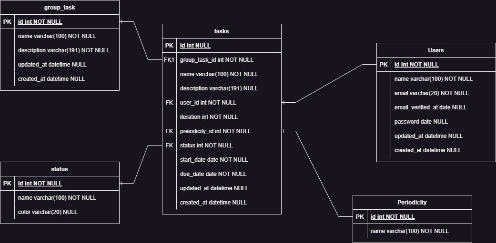

# Test-task
Aplicación desarrollada en Laravel con la librería Filamentphp, utiliza Livewire y Tailwind para construir y manejarse en las interfaces

## Requisitos funcionales

La aplicación consiste en crear tareas, estas tareas podrán asignarse a un tipo/categoría de tarea. Se define la frecuencia de la tarea y la duración.
Las tareas podrán ser creadas por usuarios autenticados. 
Los tipos/categorías de tareas tienen un nombre y una descripción
Las tareas listadas serán organizadas por fecha y las que están pendientes. Se pueden agrupar en tareas de hoy, tareas de mañana, tareas de la semana que viene, tareas en un futuro próximo y tareas en el futuro. Un usuario podrá marcar como completada una tarea


## Instalación

Clona el repositorio localmente:

```sh
git clone https://github.com/artulance/Test-task.git task && cd task
```

Instalación de las dependencias:

```sh
composer install
```

Configuración:

```sh
cp .env.example .env
```

Generar application key:

```sh
php artisan key:generate
```

Run database migrations, ante la pregunta de crear el sqlite indicar que si:

```sh
php artisan migrate
```

Run database seeder:

```sh
php artisan db:seed
```

Ejecuta el servidor de desarrollo, la salida dará la dirección que tendrá la aplicación:

```sh
php artisan serve
```
Los test están hechos con phpunit, se ejecutan con:

```sh
php artisan test
```

### Modelo 

<p align="center">
    
</p>
